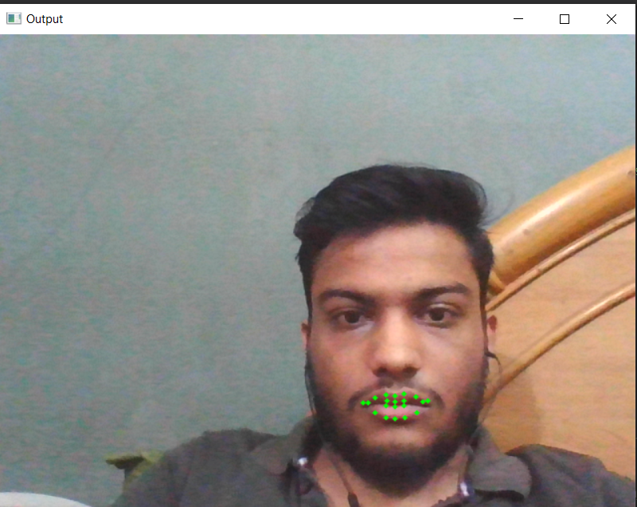
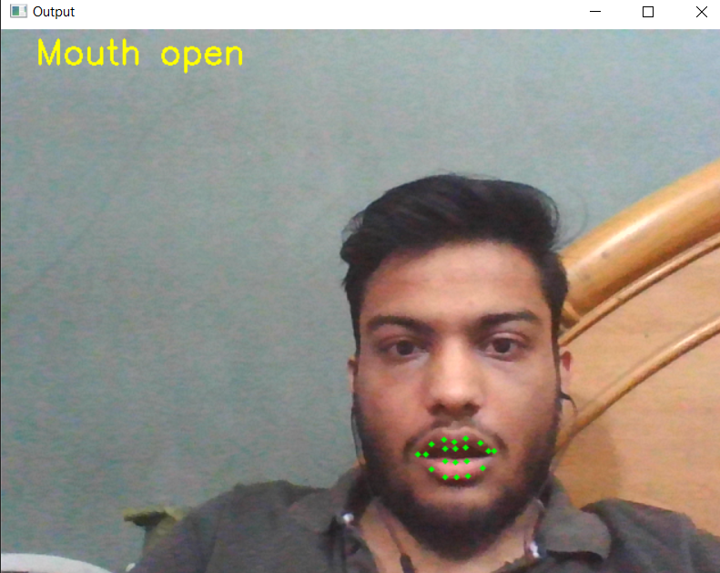

AI Proctor

AI proctor is a tool which helps teachers to take tests of students without any cheating activities.

Functions included in AI Proctor
- No person in front of screen
- Multiple persons in front of screen
- Same person in front of screen during whole duration of test
- Phone or book detection
- Lip movement
- Head pose
- Eye gaze
- Face spoofing (Only Image of person there but not actually present)
- Audio detection of person

Sample of Features present

1. No person/ Multiple faces / Is same person giving whole test

2. Phone/Book detection

3. Lip Movement

4. Head pose

5. Eye gaze

6. Face spoof

7. Audio detection